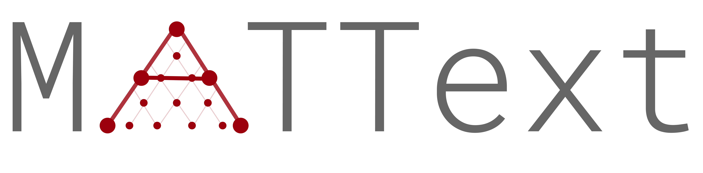

# MatText documentation

    

        
    

MatText is a framework for text-based materials modeling. It supports 

- conversion of crystal structures in to text representations 
- transformations of crystal structures for sensitivity analyses
- decoding of text representations to crystal structures
- tokenization of text-representation of crystal structures
- pre-training, finetuning and testing of language models on text-representations of crystal structures 
- analysis of language models trained on text-representations of crystal structures